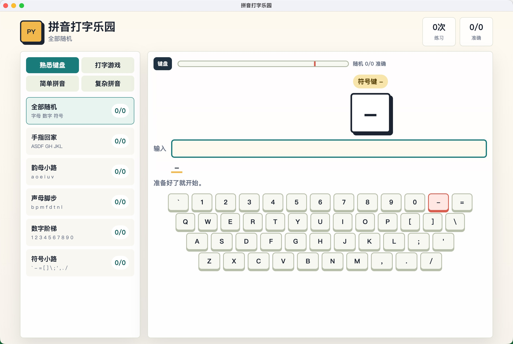
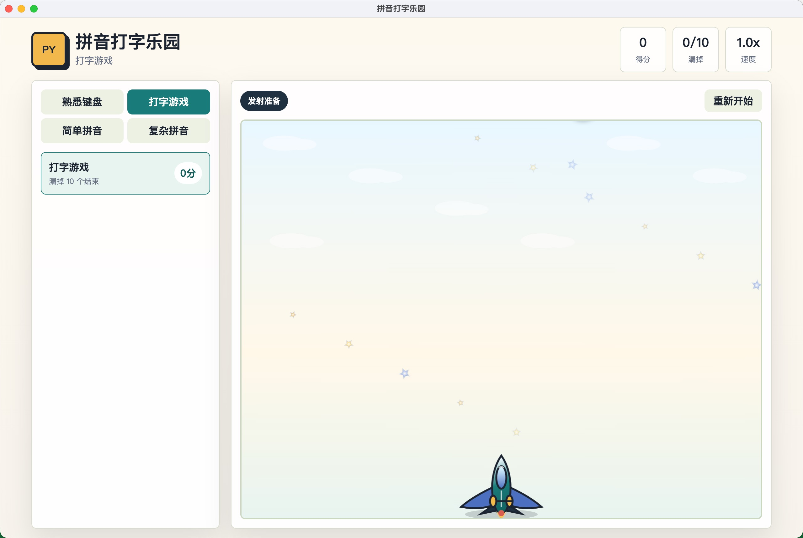
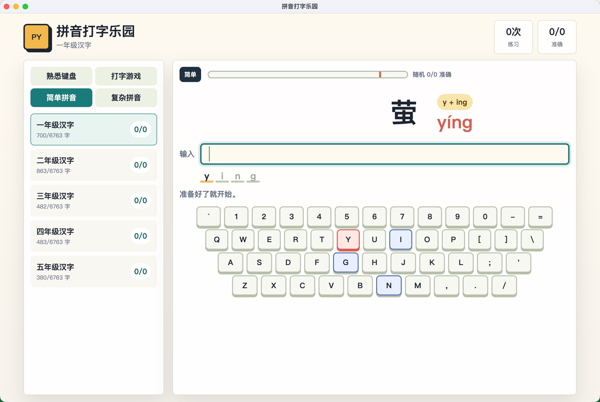
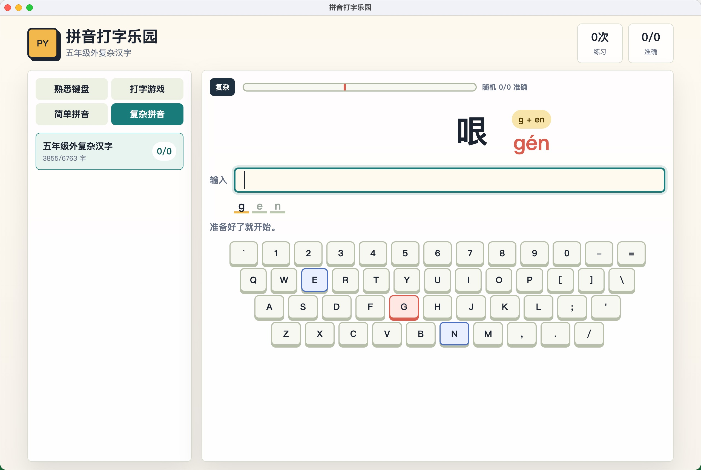

# 拼音打字乐园

面向小孩子的 H5 拼音打字练习游戏，使用 TypeScript 实现。

## 运行截图

### 熟悉键盘



### 打字游戏



### 简单拼音



### 复杂拼音



## 练习路径

1. 熟悉键盘：默认从字母、数字、符号中随机练习，也可以手动选择手指回家、韵母、声母、数字或符号分类。
2. 打字游戏：随机字母、数字、符号从画布上方落下，输入对应按键即可让飞机发射并消除目标；每消除一个得 1 分，漏掉 10 个结束。
3. 简单拼音：按 `grade.md` 中一到五年级汉字分级分类选择。
4. 复杂拼音：覆盖 GB2312 中不属于一到五年级字表的汉字。

简单和复杂题库合计覆盖 6763 个 GB2312 汉字。拼音练习会在手动选定的分类内随机出题；输入正确后会自动进入当前题库的下一题，不会自动切换难度。年级字表以 `grade.md` 为准，运行生成命令后写入 `src/gradeCharacters.ts`。

统计以实际答题结果为基数：完全答对时记为 `1/1`，首次输错时记为一次错误；题目刚出现、输入正确的中间过程、手动切换分类或手动点题都不会改变统计。刷新页面会重置当前练习和所有统计数据。

## 本地运行

```bash
npm install
npm run dev
```

## 重新生成 GB2312 题库

```bash
npm run generate:gb2312
```

## 重新生成年级题库

```bash
npm run generate:grades
```

如需同时重新生成 GB2312 和年级题库：

```bash
npm run generate:data
```

## 构建

```bash
npm run build
```

## 打包桌面应用

先安装依赖：

```bash
npm install --verbose electron
```

生成当前系统可用的桌面安装包/应用包：

```bash
npm run build:desktop
```

该命令会依次生成：

- macOS ARM64
- macOS AMD64
- Windows 64-bit

产物都会写入 `release/`，并在文件名中区分平台与架构；打包结束后只保留 `.zip` 文件，其他安装器、元数据和解包目录会自动清理。

如需单独打包：

```bash
npm run build:desktop:mac:arm64
npm run build:desktop:mac:x64
npm run build:desktop:win
```

仅生成不封装安装器的解包目录（便于本地验收）：

```bash
npm run build:desktop:dir
```

打包输出位于 `release/` 目录。桌面壳基于 Electron，直接加载前端 `dist/` 构建产物。`build:desktop:dir` 属于验收用途，不会触发“只保留 `.zip`”的清理逻辑。
